# Cybersecurity Penetration Test & Remediation Report: Capstone Assessment

**Target Networks:** `10.5.5.0/24`, `192.168.0.0/24`  
**Testing Environment:** Kali Linux, DVWA, Wireshark, SMB Clients  

---

## Executive Summary
A comprehensive penetration test was conducted across target subnets `10.5.5.0/24` and `192.168.0.0/24` to identify exploitable vulnerabilities, simulate unauthorized access, and provide actionable remediation strategies. Key findings include vulnerable SQL injection vector interfaces, misconfigured web directory indexing, anonymous SMB share permissions, and unencrypted HTTP network transmissions exposing credentials. All core security objectives were successfully achieved, and remediation recommendations were compiled to harden the target infrastructure.

---

## Technical Findings & Exploitation

### Challenge 1: SQL Injection & Target Host Compromise
* **Target:** `10.5.5.12` (DVWA) & `192.168.0.10`
* **Vulnerability:** SQL Injection (SQLi) in web input forms
* **Execution Summary:**
  1. Authenticated to `10.5.5.12` with initial credentials `admin / password` and configured DVWA security to Low.
     
     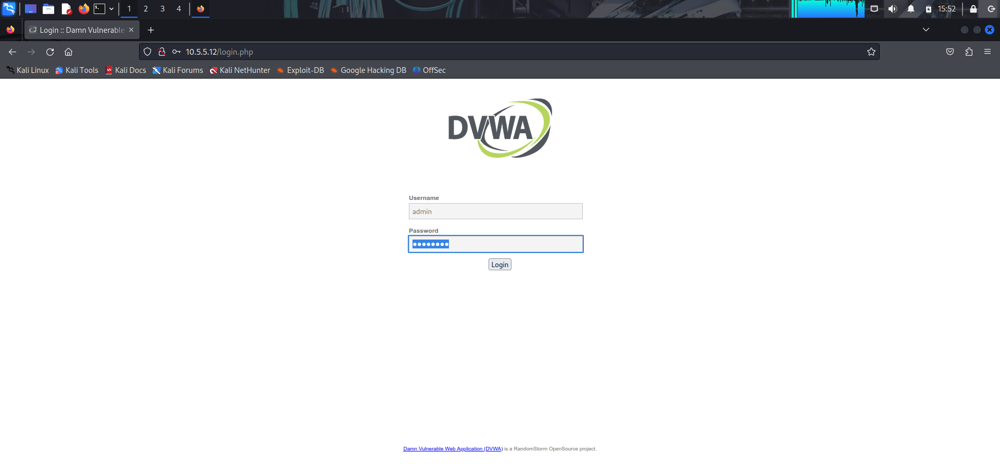
      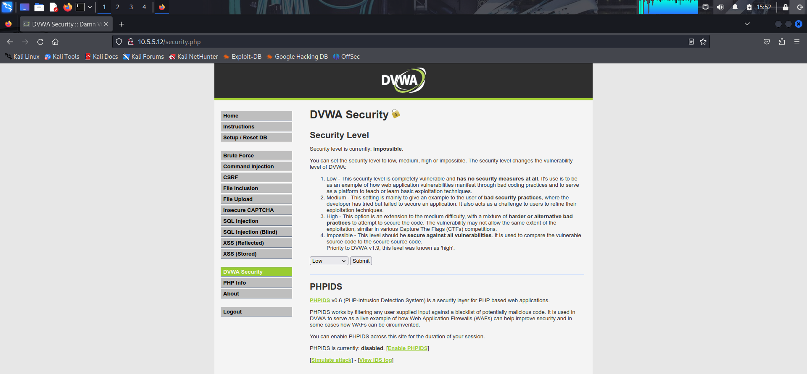
     
  2. Injected SQL payloads into the user submission form to extract user account hashes from the database.
     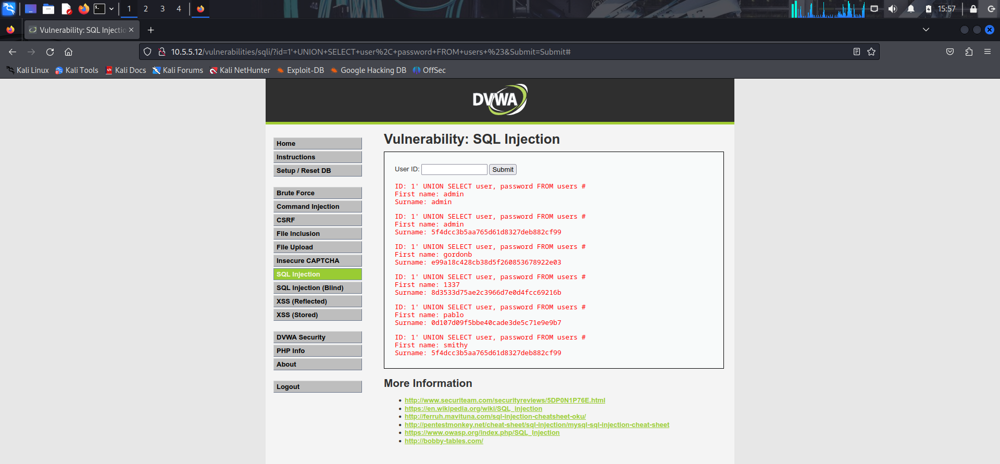
     
  3. Extracted Bob Smith’s credential hash and cracked the plaintext password using hash-cracking utilities.
     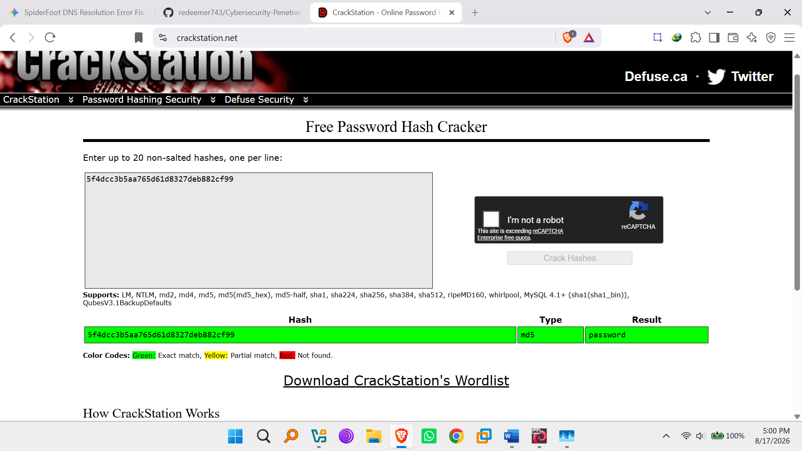
     
  4. Established an SSH connection to `192.168.0.10` as `smithy` (`smithy@192.168.0.10`) using the cracked password.
       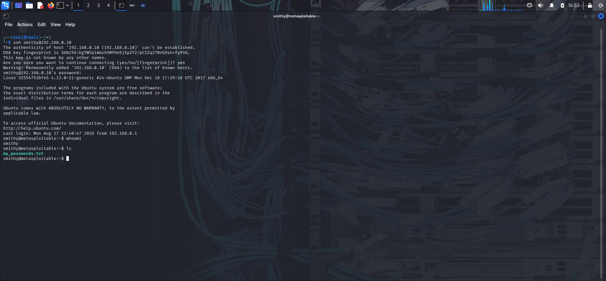
     
  5. Inspected the user home directory to recover the flag file.
     

* **Proof of Concept & Results:**
  * **Bob Smith Password:** `password`
    
  * **SSH Access Command:** `ssh smithy@192.168.0.10`
   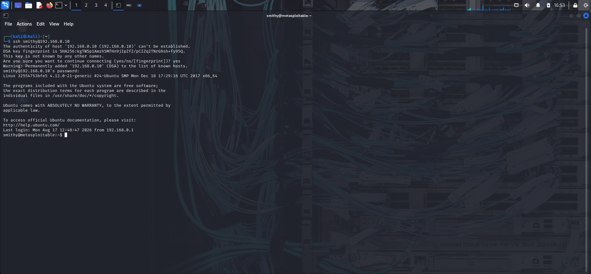
  * **Flag Filename:** `my_passwords.txt`
    
  * **Flag Content:** `Congratulations! You found the flag for Challenge 1!`
  * **Flag Code:** `8748wf8J`
      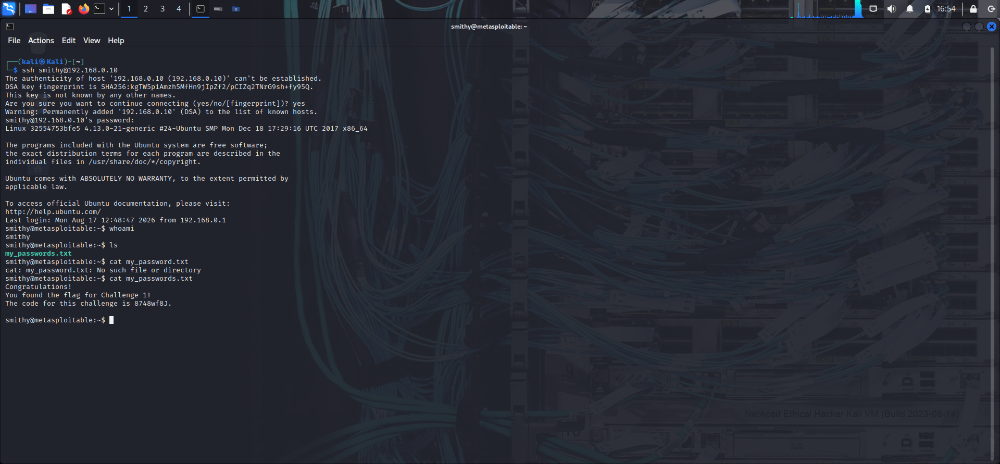

* **Remediation Methods:**
  1. **Prepared Statements:** Utilize parameterized queries to segregate user input from SQL commands.
  2. **Principle of Least Privilege:** Restrict database service accounts to minimum necessary operations.
  3. **Escaping & Sanitization:** Sanitize all special characters within user inputs prior to processing.
  4. **Allow-List Input Validation:** Validate input against allowed character patterns and data types.
  5. **Stored Procedures:** Abstract database execution through secured, pre-compiled stored procedures.

---

### Challenge 2: Web Server Directory Listing Misconfiguration
* **Target:** `10.5.5.12`
* **Vulnerability:** Unrestricted Directory Indexing / Information Disclosure
* **Execution Summary:**
  1. Performed web reconnaissance across web root directories.
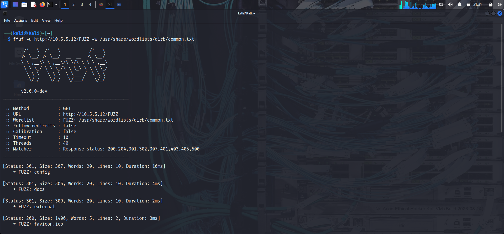
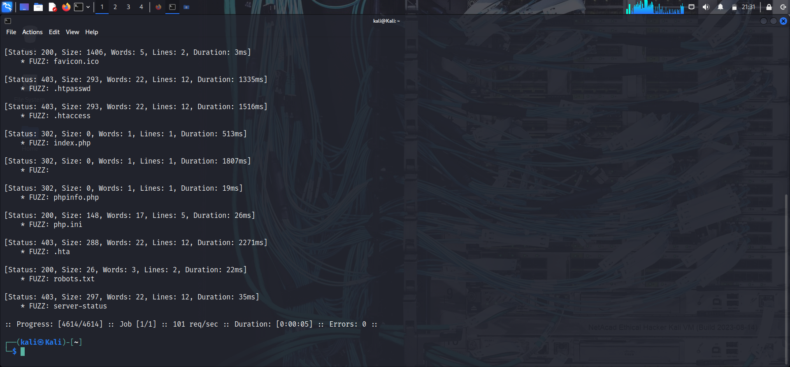
  2. Identified exposed directories displaying raw index views via web browser URL manipulation.
     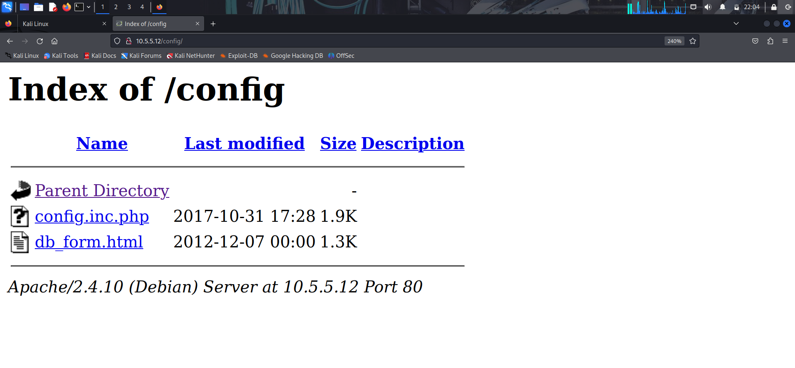
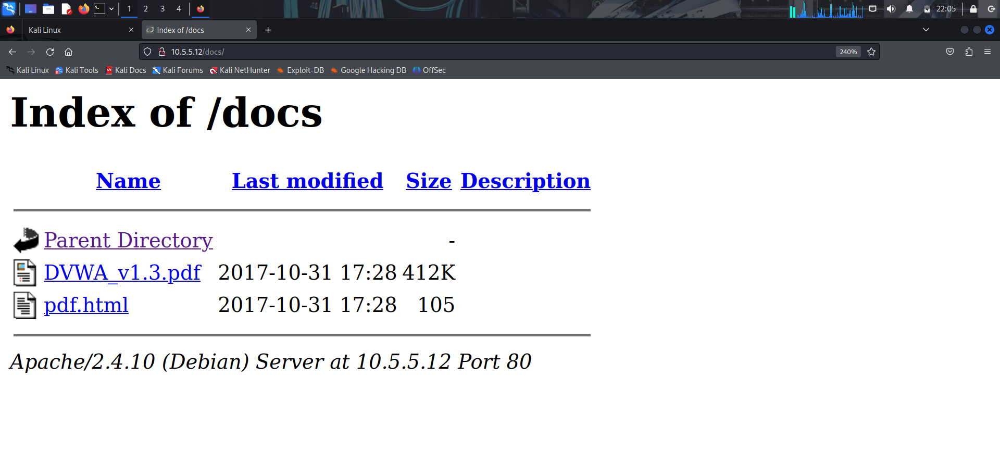
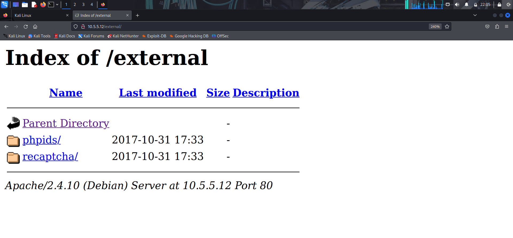
  3. Navigated through index paths to uncover hidden resources (`db_form.html`) and retrieve the Challenge 2 flag code.
     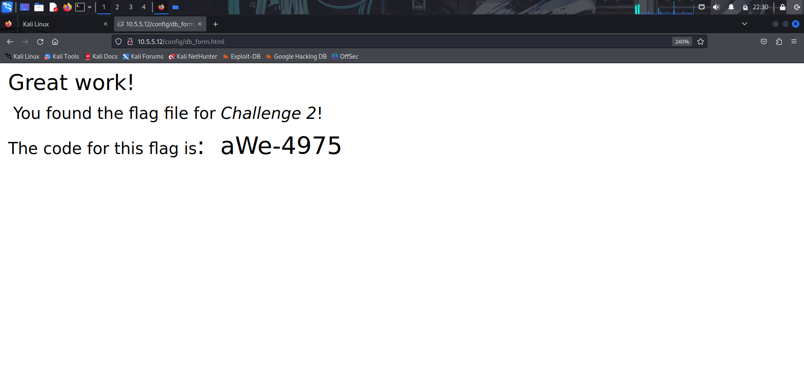
* **Proof of Concept & Results:**
  * **Indexed Web Directories:** `Config` and `docs`
     

  * **Target File Search Paths:** `Config` and `external`
     

  * **Filename:** `db_form.htmlere.`
  * **Flag File Location:** `Config`
    
  * **Flag Content:** `Great work! You found the flag file for Challenge 2!`
  * **Flag Code:** `aWe-4975`
    

* **Remediation Methods:**
  1. **Disable Directory Indexing:** Configure web server controls (e.g., `Options -Indexes` in Apache) to deny directory browsing.
  2. **Deploy Default Index Files:** Place default index pages (e.g., `index.html`) in all public web directories to prevent index views.

---

### Challenge 3: Unsecured SMB Share Enumeration
* **Target Subnet:** `10.5.5.0/24`
* **Vulnerability:** Unauthenticated/Anonymous SMB Share Access
* **Execution Summary:**
  1. Scanned `10.5.5.0/24` for open SMB services (ports 139/445).
     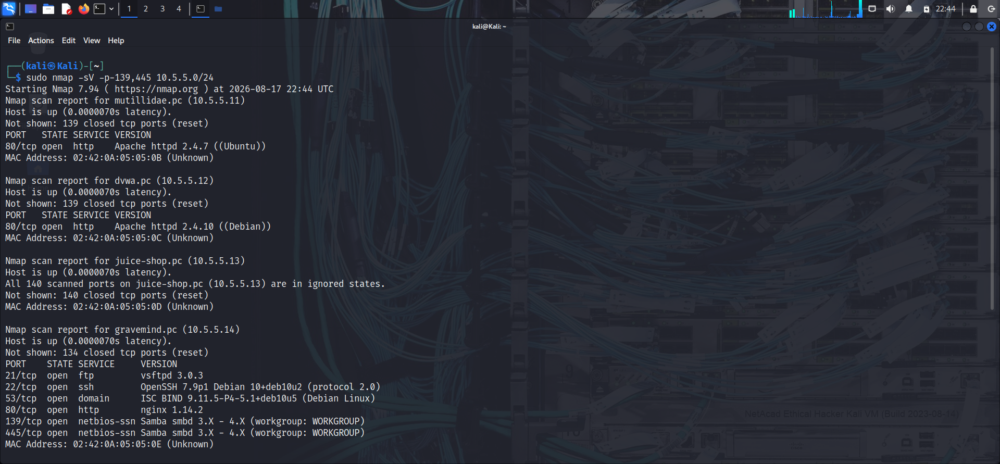
     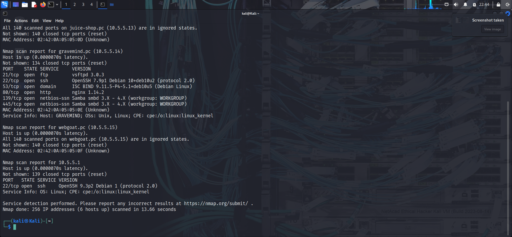
  2. Identified SMB host `10.5.5.14` and enumerated shared directories.
  4. Discovered unauthenticated read access allowed on the `Workfiles` and `Print$` shares.
  5. Connected via SMB client, navigated to the target directory, and downloaded the flag document.
* **Proof of Concept & Results:**
  * **SMB Server IP:** `10.5.5.14`
  * **Enumerated Shares:** `Homes`, `Workfiles`, `IPC$`, `Print$`
  * **Anonymous Access Shares:** `Workfiles`, `Print$`
  * **Flag Share Path:** `OTHER`
  * **Flag Filename:** `sxij42.txt.`
  * **Flag Code:** `NWs39691`

  
*Figure 3: Connecting to the SMB target with anonymous credentials and retrieving the target flag.*

* **Remediation Methods:**
  1. **Network Isolation & Segmentation:** Segment SMB endpoints and enforce access controls across internal VLANs.
  2. **Firewall & Access Control Rules:** Enforce network firewalls to block unauthorized SMB traffic and require strong user authentication for all shared resources.

---

### Challenge 4: Traffic Analysis (`SA.pcap`) & Clear-Text Data Exfiltration
* **Target Asset:** `SA.pcap` Capture File
* **Vulnerability:** Transmission of Sensitive Data via Unencrypted Protocols (HTTP Clear-Text)
* **Execution Summary:**
  1. Parsed `SA.pcap` in Wireshark to reconstruct HTTP streams and discover target network paths.
  2. Extracted host target IP address `10.5.5.11` and identified sensitive endpoints.
  3. Reconstructed the HTTP URL (`http://10.5.5.11/data/user_accounts.xml`) exposing employee credentials in clear text.
  4. Isolated Employee ID `0` record to extract flag credentials.
* **Proof of Concept & Results:**
  * **Target Computer IP:** `10.5.5.11`
  * **Discovered Directories:** `Data`, `includes`, `passwords`, `phpmyadmin`, `test`, `images`, `styles`, `webservices`
  * **Full Target URL:** `http://10.5.5.11/data/user_accounts.xml`
  * **Employee ID 0 Message:** `Here is the Code for Challenge 4!`
  * **Flag Code:** `21z-1478K`

  
*Figure 4: Inspecting HTTP clear-text streams in Wireshark to extract target user account information.*

* **Remediation Methods:**
  1. **HTTPS / TLS Encryption:** Migrate clear-text web interfaces to HTTPS utilizing TLS/SSL encryption.
  2. **Secure File Transfer Protocols:** Use secure protocols (e.g., SFTP, HTTPS) for transferring sensitive organizational files.
